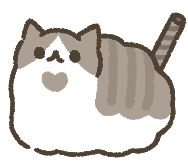

# 資管三甲 C112118140 劉政承
這是我的個人網頁，\
我會來自我介紹，\
讓你明白我是什麼樣的一個人，\
裡面會有我的自我介紹，\
所以這是關於我的網頁。

*總而言之就是一個自我介紹的網頁*\
*對，是一個網頁*\
*關於我的網頁*

## [關於我]
- 愛亂畫可愛跟抽象的東西
- 躺平(你敢相信我寫這篇也在躺)
- 重度貓癮患者[三度勒戒失敗]
- MBTI：LAZY
## [超能力(技能)]
- 擁有只需閉眼一秒就從早上7點穿越到早上10點的實用能力
- **可以在12天完成1小時的事和一小時完成12天才能完成的事**
- 極端情況可以100元解決三餐
- 擁有禱告能力祝福程式運作成功(50%50%)
- 課本內容過目即忘的實用技能
- 看到E人群眾可以迅速離場的閃現技能

*座右銘： 老師🥺 菜菜🙏🏻 撈撈😭*

## 最喜歡的網站連結
[喵](https://xn--i2r.tw/)

## [亂亂畫]
- 捲心酥貓貓



- 醜魚


## [我的運作程式碼]

```python
#-----------------------
alarm_ringing = True
sleep = True
if alarm_ringing:
    alarm_ringing = False
    sleep = True
else:
    alarm_ringing = True
    sleep = True

#-----------------------
hungry = False

if hungry:
    eat()
    hungry = False
else:
    print("躺平")
#-----------------------
brain = "working"
in_class = True

if in_class:
    brain = "error"
else:
    brain = "working"
#-----------------------
```
> 名言：\
> 我們總是想著遇到困難就放棄，可能連嘗試都沒有就覺得困難，\
> 但其實當我們決定認真面對的時候，這一切，似乎就沒有想像中那麼困難了!

|學歷|校名+科系|
|:--:|:--:|
|高中|市立楊梅高級中學-資訊科|
|大學|國立高雄科技大學 資訊管理系(就讀中)|

> 程式碼之所以有價值， 是因為它能被閱讀、理解和修改。 版本控制使這一切成為可能。

 | 任務名稱 | 狀態 | 負責人 | 截止日期 |
 |---|:---:|:---:|---:|
 | 需求分析 | 完成 | 小明 | 2023-01-15 |
 | 資料庫設計 | 進行中 | 小華 | 2023-01-30 |
 | 前端介面 | 未開始 | 小李 | 2023-02-15 |

>太努力啦!! 竟然滑到這了!!!
>>第一次遇到這麼想了解我的人!!!!!!
>>>來! 這是獎勵! 點擊領取!!!!!!!!!!!!!\
[>>點我獲得超大豪華大禮<<](https://www.youtube.com/watch?v=fC7oUOUEEi4)
